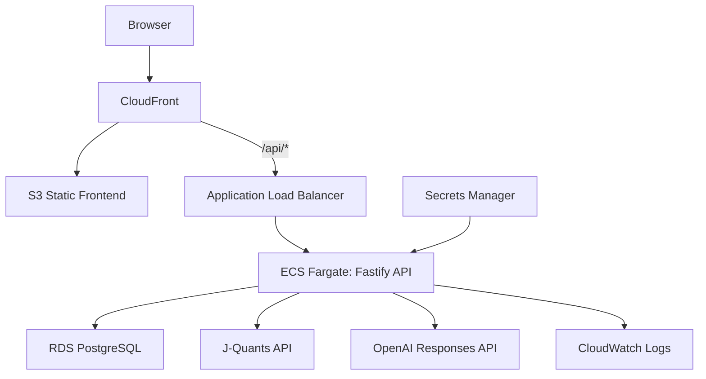
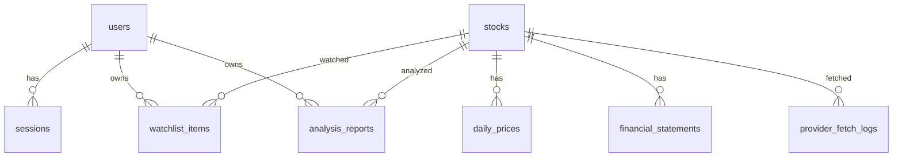

# AlphaLens JP 設計ドキュメント

AlphaLens JPは、日本株の財務データ・株価データ・企業情報を統合し、AIがファンダメンタルズ調査メモを生成するSaaSです。

目的は「投資助言」ではなく、企業調査に必要な情報収集・整理・比較を効率化することです。AIレポートには免責文と根拠データを表示し、売買推奨・目標株価・株価予測は扱いません。

## 目次
- [1. プロジェクト概要](#overview)
- [2. ドキュメント構成](#documents)
- [3. MVPの結論](#mvp-summary)
- [4. 実装構成](#implementation)
- [5. ローカル起動](#local-dev)
- [6. API設計サマリ](#api-summary)
- [7. DB設計サマリ](#db-summary)
- [8. テスト・検証](#verification)
- [9. 採用向けアピール軸](#career-points)
- [10. 実装時のCodex向け指示](#codex-instructions)
- [11. 参照データソース](#sources)

<a id="overview"></a>
## 1. プロジェクト概要

ユーザーは銘柄を検索し、財務指標・株価推移・AI分析レポート・Watchlist・分析履歴を通じて、調査メモを継続的に管理できます。

<a id="documents"></a>
## 2. ドキュメント構成

- [docs/01_requirements.md](./docs/01_requirements.md): 要件定義、MVP範囲、ユーザーストーリー、非機能要件
- [docs/02_system_design.md](./docs/02_system_design.md): システム構成、画面、データフロー、セキュリティ方針
- [docs/03_api_design.md](./docs/03_api_design.md): REST API設計、リクエスト/レスポンス、エラー仕様
- [docs/04_db_design.md](./docs/04_db_design.md): DB設計、ER図、テーブル定義、インデックス
- [docs/05_ai_design.md](./docs/05_ai_design.md): AI分析機能、プロンプト、ガードレール、評価方針
- [docs/06_infra_design.md](./docs/06_infra_design.md): AWS構成、CI/CD、監視、コスト管理
- [docs/07_test_design.md](./docs/07_test_design.md): テスト設計、結合テスト、AI評価、スモークテスト
- [docs/08_roadmap.md](./docs/08_roadmap.md): 実装ロードマップ、優先順位、将来拡張

<a id="mvp-summary"></a>
## 3. MVPの結論

MVPでは次を作ります。

- 日本株の銘柄検索
- 銘柄詳細ページ
- 企業基本情報の表示
- 株価推移の表示
- 財務サマリの表示
- AIファンダメンタルズ分析レポート生成
- Watchlist登録
- 分析履歴保存
- ログイン
- AWS上への最小構成デプロイ

MVPでは次を作りません。

- 売買推奨
- 株価予測
- 証券口座連携
- 自動売買
- リアルタイム株価
- 高度なポートフォリオ管理
- 有料課金機能

<a id="implementation"></a>
## 4. 実装構成

```text
alphalens-jp/
  frontend/        Next.js static export UI
  backend/         Fastify REST API, Drizzle ORM, market/AI service layer
  infra/           AWS CDK v2 TypeScript
  docs/            Requirements and design documents
  docker-compose.yml
```

採用技術:

- Frontend: Next.js、React、TypeScript
- Backend: Node.js / TypeScript、Fastify、Drizzle ORM
- Database: PostgreSQL、drizzle-kit migration
- AI: OpenAI Responses API、Structured Outputs、JSON Schema検証、Mock AI
- Market data: `MarketDataProvider` 抽象化、Mock Provider、J-Quants Provider
- Auth: HttpOnly session cookie、DB保存トークンハッシュ、Double Submit Cookie CSRF
- Infra: AWS CDK v2、S3、CloudFront、ALB、ECS Fargate、RDS PostgreSQL、Secrets Manager、CloudWatch Logs/Alarms

MVPは外部APIキーなしでも `MARKET_DATA_PROVIDER=mock` と `AI_PROVIDER=mock` で主要導線を確認できます。J-QuantsとOpenAIを使う場合は、環境変数で provider を切り替えます。

J-Quants ProviderはV2/APIキー方式を既定にしています。実データを使う場合は `MARKET_DATA_PROVIDER=jquants`、`JQUANTS_API_VERSION=v2`、`JQUANTS_API_KEY` を設定します。旧V1互換が必要な場合だけ `JQUANTS_API_VERSION=v1` と `JQUANTS_EMAIL` / `JQUANTS_PASSWORD` を使います。



MVPではコストを抑えるため、ECS TaskはPublic Subnet + Public IPで外部APIへ接続します。本来の商用運用ではPrivate Subnet + NAT Gatewayを採用します。

<a id="local-dev"></a>
## 5. ローカル起動

```bash
npm install
docker compose up -d postgres
npm run db:migrate
npm run db:seed
npm run dev:backend
npm run dev:frontend
```

- Frontend: http://localhost:3000
- Backend health: http://localhost:4000/api/health
- PostgreSQL: `localhost:15432`

`frontend/next.config.mjs` は開発時だけ `/api/*` を backend へ proxy します。本番ビルドは静的exportとしてS3 + CloudFrontへ配置する想定です。

AWSのECSタスクでは `RUN_MIGRATIONS_ON_START=true` を設定し、コンテナ起動時に `backend/drizzle/` のmigrationをRDSへ適用します。ローカル開発では明示的に `npm run db:migrate` を実行します。

<a id="api-summary"></a>
## 6. API設計サマリ

主要API:

- `GET /api/health`
- `GET /api/auth/csrf`
- `POST /api/auth/register`
- `POST /api/auth/login`
- `POST /api/auth/logout`
- `GET /api/auth/me`
- `GET /api/stocks`
- `GET /api/stocks/:code`
- `GET /api/stocks/:code/prices`
- `GET /api/stocks/:code/financials`
- `GET /api/watchlist`
- `POST /api/watchlist`
- `DELETE /api/watchlist/:code`
- `POST /api/stocks/:code/analysis-reports`
- `GET /api/analysis-reports`
- `GET /api/analysis-reports/:id`

状態変更APIはすべて `al_csrf` Cookie と `X-CSRF-Token` ヘッダーを照合します。セッションCookieは本番で `__Host-al_session`、ローカルHTTPで `al_session` を使います。

<a id="db-summary"></a>
## 7. DB設計サマリ



主な設計:

- ユーザー固有データは `user_id` で分離する。
- セッショントークンは生値をCookie、SHA-256ハッシュをDBに保存する。
- `stocks.code` は表示用4桁コードを基本とし、外部API用に `provider_code` を分ける。
- 外部APIの生レスポンスはMVPでは保存しない。正規化済みデータと取得ログだけ保存する。
- AIレポートは `input_hash` を保存し、同一入力では既存レポートを再利用できる。

<a id="verification"></a>
## 8. テスト・検証

ローカルで実行する主な検証:

```bash
docker compose up -d postgres
npm run lint
npm run typecheck
npm test
npm run smoke:local
npm run build
npm run db:migrate
npm run db:seed
```

`npm test` のAPI結合テストは、既定で `alphalens_test` DBを作成して使用します。誤操作防止のため、DB名に `test` を含まない `DATABASE_URL` では `ALLOW_NON_TEST_DATABASE=true` がない限り破壊的なTRUNCATEを実行しません。

`npm run smoke:local` は、既定で `alphalens_smoke` DBを作成して使用します。別DBで確認したい場合は `ALPHALENS_SMOKE_DATABASE_URL` または `DATABASE_URL` を指定します。

確認済みのスモーク導線:

- `npm run smoke:local` が実HTTPサーバーを起動し、`GET /api/health` がDB接続込みで200を返す。
- 実HTTPでCSRF取得、登録、検索、銘柄詳細、Watchlist追加、AIレポート生成、分析履歴、ログアウト後401がMock Providerで一連動作する。
- AIレポートには免責文、根拠データ、データ制約が含まれる。
- Watchlistと分析履歴はログインユーザー単位で保存される。

AWS公開URLへのデプロイは `infra/` のCDKで実行する想定です。デプロイ後はCloudFront URL、API health、ログイン、銘柄検索、AIレポート生成、CloudWatch Logs/Alarmsを確認します。

CDKはデフォルトでは `MARKET_DATA_PROVIDER=mock`、`AI_PROVIDER=mock` でデプロイします。実APIを使う場合は、先にSecrets Managerへキーを保存し、contextでsecret名または完全ARNを渡します。

```bash
npm run synth -w infra -- \
  -c marketDataProvider=jquants \
  -c jquantsApiKeySecretName=alphalens/jquants-api-key \
  -c aiProvider=openai \
  -c openAiApiKeySecretName=alphalens/openai-api-key
```

<a id="career-points"></a>
## 9. 採用向けアピール軸

このプロジェクトで見せる技術要素は次です。

- フロントエンド: Next.js、TypeScript、ダッシュボードUI、チャート、フォーム
- バックエンド: Node.js / TypeScript API、Fastify、Drizzle ORM、外部API連携、認証、集計処理
- DB: PostgreSQL、drizzle-kit migration、財務時系列データ、分析履歴、Watchlist
- AI: OpenAI Responses API、Structured Outputs、根拠データ付きレポート生成、プロンプト設計、出力検証
- AWS: S3 + CloudFront、ECS/Fargate、ALB、RDS、Secrets Manager、CloudWatch Logs/Alarms、AWS CDK
- 将来拡張: S3 artifact/RAG保存、SQS、EventBridge、Workerによる非同期処理
- 運用: GitHub Actions、IaC、ログ、メトリクス、エラー監視

面接では「株価を当てるアプリ」ではなく、「企業調査の情報収集と分析を効率化するデータSaaS」と説明します。

<a id="codex-instructions"></a>
## 10. 実装時のCodex向け指示

Codexが実装に入るときは、次の順で読んでください。

1. `README.md`
2. `docs/01_requirements.md`
3. `docs/02_system_design.md`
4. `docs/04_db_design.md`
5. `docs/03_api_design.md`
6. `docs/05_ai_design.md`
7. `docs/06_infra_design.md`
8. `docs/07_test_design.md`
9. `docs/08_roadmap.md`

実装判断で迷った場合は、MVP範囲を優先してください。投資助言、株価予測、自動売買につながる機能はMVPに入れません。

外部APIの仕様は変更される可能性があるため、実装前にJ-Quants APIの現行仕様を確認してください。J-Quants APIはV2移行が進んでいるため、実装はV2/APIキー方式を既定にし、V1は明示的な互換モードとして扱います。

<a id="sources"></a>
## 11. 参照データソース

- J-Quants API: https://www.jpx.co.jp/markets/other-data-services/j-quants-api/index.html
- J-Quants API docs: https://jpx.gitbook.io/j-quants-ja/api-reference
- J-Quants API client: https://github.com/J-Quants/jquants-api-client-python
- EDINET API catalog: https://api-catalog.e-gov.go.jp/info/ja/apicatalog/view/33
- EDINET DB API: https://edinetdb.jp/docs/api （非公式/第三者サービス。MVPでは依存しない）
- OpenAI Responses API: https://platform.openai.com/docs/api-reference/responses
- OpenAI Structured Outputs: https://platform.openai.com/docs/guides/structured-outputs
