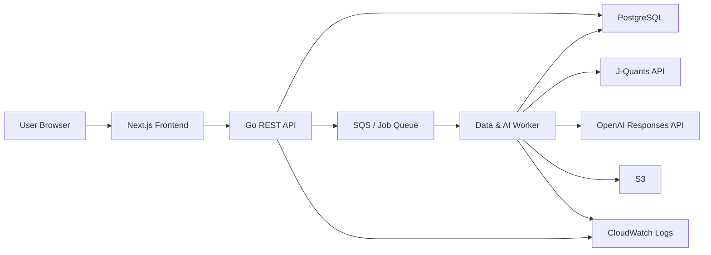
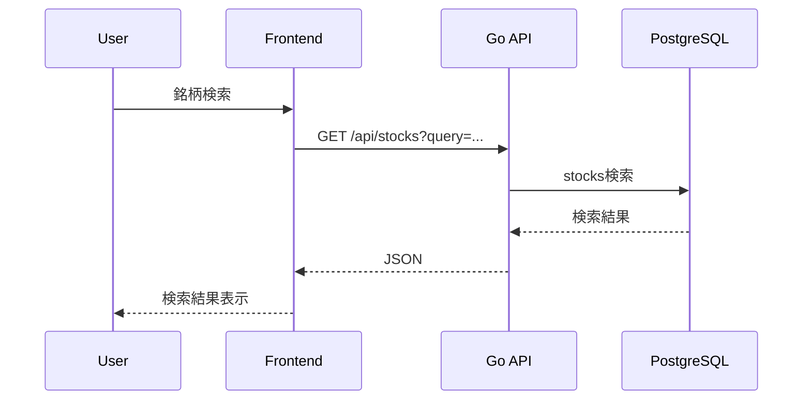
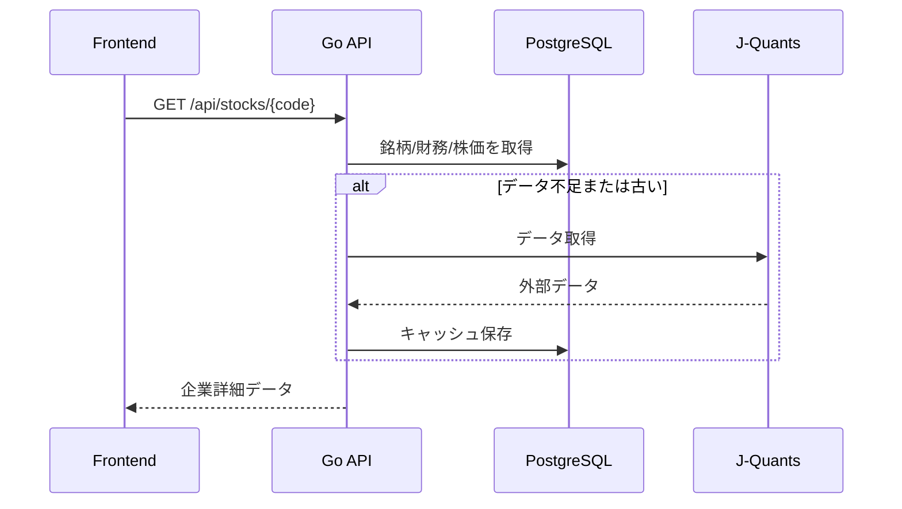
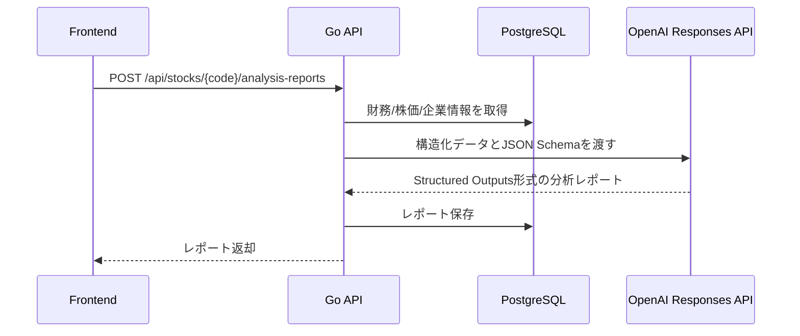

# AlphaLens JP 基本設計書

## 目次
- [1. システム概要](#overview)
- [2. 全体アーキテクチャ](#architecture)
- [3. コンポーネント構成](#components)
- [4. 画面設計](#screens)
- [5. データフロー](#data-flow)
- [6. 認証・認可](#auth)
- [7. 外部API連携](#external-api)
- [8. エラー設計](#error-design)
- [9. セキュリティ設計](#security)
- [10. ログ・監視](#logging)

<a id="overview"></a>
## 1. システム概要

AlphaLens JPは、Next.jsフロントエンド、Goバックエンド、PostgreSQL、AWS基盤で構成するWebアプリケーションです。

外部データソースから日本株データを取得し、DBにキャッシュします。ユーザーはブラウザから銘柄を検索し、財務・株価・AI分析を確認します。

<a id="architecture"></a>
## 2. 全体アーキテクチャ



MVPでは、WorkerをGo APIプロセス内のジョブとして実装してもよいです。AWSデプロイ時にSQS/Workerへ分離できるよう、処理単位をサービス層で分けます。

<a id="components"></a>
## 3. コンポーネント構成

| コンポーネント | 技術 | 責務 |
| --- | --- | --- |
| Frontend | Next.js / TypeScript | 画面、フォーム、チャート、API呼び出し |
| Backend API | Go | REST API、認証、DBアクセス、外部API連携制御 |
| Worker | Go | データ同期、AIレポート生成、再試行 |
| Database | PostgreSQL | ユーザー、銘柄、株価、財務、分析履歴を保存 |
| Object Storage | S3 | 将来のPDF、CSV、分析スナップショット保存 |
| Queue | SQS | 非同期ジョブ管理 |
| Scheduler | EventBridge | 定期データ更新 |
| Monitoring | CloudWatch | ログ、メトリクス、アラーム |

<a id="screens"></a>
## 4. 画面設計

### 4.1 Dashboard

表示項目:

- Watchlist
- 最近分析した銘柄
- AI分析ジョブの状態
- 直近のデータ更新日時

### 4.2 Stock Search

表示項目:

- 検索入力
- 業種フィルター
- 市場フィルター
- 検索結果テーブル

検索結果テーブル:

| 項目 | 内容 |
| --- | --- |
| 銘柄コード | 例: 7203 |
| 企業名 | 例: トヨタ自動車 |
| 市場 | Prime / Standard / Growth |
| 業種 | 33業種名 |
| アクション | 詳細、Watchlist追加 |

### 4.3 Company Detail

表示項目:

- 企業基本情報
- 株価チャート
- 財務サマリカード
- 財務推移グラフ
- AI分析生成ボタン
- 最新AIレポート

### 4.4 AI Report

表示項目:

- 成長性
- 収益性
- 安全性
- 懸念点
- 追加で確認すべき点
- 利用データ
- 免責文

### 4.5 Analysis History

表示項目:

- 過去レポート一覧
- 対象銘柄
- 生成日時
- 使用データ期間
- レポート詳細

<a id="data-flow"></a>
## 5. データフロー

### 5.1 銘柄検索



### 5.2 銘柄詳細表示



### 5.3 AIレポート生成



<a id="auth"></a>
## 6. 認証・認可

MVPでは次のどちらかを選びます。

- 案A: Next.js側でAuth.jsを使い、APIにはJWTを渡す
- 案B: Go APIでメール/パスワード認証を実装し、HttpOnly Cookieを発行する

推奨は案Bです。Goバックエンドの設計力を見せやすく、APIと認証の責務が明確になります。

認可方針:

- Watchlist、分析履歴、ユーザー設定は本人のみ参照可能
- 銘柄、株価、財務データは全ユーザー共通
- 管理者機能はMVPでは実装しない

<a id="external-api"></a>
## 7. 外部API連携

外部APIは次のインターフェースで抽象化します。

```go
type MarketDataProvider interface {
    SearchStocks(ctx context.Context, query StockSearchQuery) ([]Stock, error)
    GetStockProfile(ctx context.Context, code string) (*StockProfile, error)
    GetDailyPrices(ctx context.Context, code string, from time.Time, to time.Time) ([]DailyPrice, error)
    GetFinancialStatements(ctx context.Context, code string) ([]FinancialStatement, error)
}
```

実装候補:

- `JQuantsProvider`: J-Quants APIを呼び出す
- `MockMarketDataProvider`: ローカル開発とテスト用
- `EdinetProvider`: 将来の有価証券報告書連携用

<a id="error-design"></a>
## 8. エラー設計

| エラー | APIレスポンス | UI表示 |
| --- | --- | --- |
| 認証なし | 401 | ログイン画面へ誘導 |
| 権限なし | 403 | 権限がない旨を表示 |
| 銘柄なし | 404 | 銘柄が見つからない |
| 外部API制限 | 429 | 時間を置いて再試行 |
| 外部API失敗 | 502 | データ取得に失敗 |
| AI生成失敗 | 503 | レポート生成に失敗 |
| バリデーション | 400 | 入力エラーを表示 |

<a id="security"></a>
## 9. セキュリティ設計

- 外部APIキーはフロントエンドに渡さない。
- パスワードはハッシュ化する。
- Cookieを使う場合はHttpOnly、Secure、SameSiteを設定する。
- CORSはフロントエンドの本番ドメインだけ許可する。
- APIリクエストにレート制限を設ける。
- AIプロンプトにはユーザー入力をそのまま命令として扱わない。
- ログにAPIキー、パスワード、個人情報を出力しない。

<a id="logging"></a>
## 10. ログ・監視

記録するログ:

- APIリクエストID
- ユーザーID
- 銘柄コード
- 外部API呼び出し結果
- AI生成結果のステータス
- エラーコード
- 処理時間

メトリクス:

- APIレスポンスタイム
- 外部API失敗率
- AI生成失敗率
- レポート生成数
- Watchlist登録数
