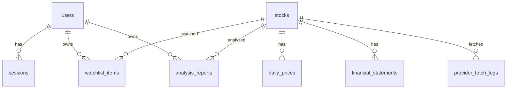

# AlphaLens JP DB設計書

## 目次
- [1. DB概要](#overview)
- [2. ER図](#er)
- [3. テーブル一覧](#tables)
- [4. テーブル定義](#table-definitions)
- [5. インデックス設計](#indexes)
- [6. データ更新方針](#data-update)
- [7. 派生指標](#derived-metrics)

<a id="overview"></a>
## 1. DB概要

DBはPostgreSQLを使用します。MVPではユーザー関連データと市場データを同一DBに保存します。

データ分類:

- ユーザー固有データ: users、sessions、watchlist_items、analysis_reports
- 共通市場データ: stocks、daily_prices、financial_statements
- 運用データ: provider_fetch_logs
- DBアクセスはDrizzle ORMを使い、スキーマ定義とマイグレーションは `backend/src/db/schema.ts` と `backend/drizzle/` に置きます。

<a id="er"></a>
## 2. ER図



<a id="tables"></a>
## 3. テーブル一覧

| テーブル | 内容 |
| --- | --- |
| users | ユーザー |
| sessions | ログインセッション |
| stocks | 銘柄マスタ |
| daily_prices | 日次株価 |
| financial_statements | 財務サマリ |
| watchlist_items | Watchlist |
| analysis_reports | AI分析レポート |
| provider_fetch_logs | 外部API取得ログ |

<a id="table-definitions"></a>
## 4. テーブル定義

### 4.1 users

| カラム | 型 | 制約 | 内容 |
| --- | --- | --- | --- |
| id | uuid | PK | ユーザーID |
| email | varchar(255) | unique, not null | メール |
| password_hash | text | not null | パスワードハッシュ |
| created_at | timestamptz | not null | 作成日時 |
| updated_at | timestamptz | not null | 更新日時 |

### 4.2 sessions

| カラム | 型 | 制約 | 内容 |
| --- | --- | --- | --- |
| id | uuid | PK | セッションID |
| user_id | uuid | FK, not null | ユーザーID |
| token_hash | text | unique, not null | セッショントークンのハッシュ |
| expires_at | timestamptz | not null | 期限 |
| created_at | timestamptz | not null | 作成日時 |

### 4.3 stocks

| カラム | 型 | 制約 | 内容 |
| --- | --- | --- | --- |
| code | varchar(10) | PK | アプリ内銘柄コード。普通株は4桁表示コードを基本とする |
| display_code | varchar(10) | not null | UI表示用コード |
| provider_code | varchar(10) | unique, not null | J-Quantsなど外部API向けコード |
| name | text | not null | 企業名 |
| name_en | text | null | 英語企業名 |
| market | text | null | 市場区分 |
| sector17_code | text | null | 17業種コード |
| sector17_name | text | null | 17業種名 |
| sector33_code | text | null | 33業種コード |
| sector33_name | text | null | 33業種名 |
| listed_at | date | null | 上場日 |
| delisted_at | date | null | 上場廃止日 |
| provider | text | not null | データソース |
| provider_updated_at | timestamptz | null | データソース更新日時 |
| created_at | timestamptz | not null | 作成日時 |
| updated_at | timestamptz | not null | 更新日時 |

### 4.4 daily_prices

| カラム | 型 | 制約 | 内容 |
| --- | --- | --- | --- |
| id | bigserial | PK | ID |
| stock_code | varchar(10) | FK, not null | 銘柄コード |
| date | date | not null | 日付 |
| open | numeric(18, 4) | null | 始値 |
| high | numeric(18, 4) | null | 高値 |
| low | numeric(18, 4) | null | 安値 |
| close | numeric(18, 4) | null | 終値 |
| adjusted_close | numeric(18, 4) | null | 調整済み終値 |
| volume | numeric(20, 2) | null | 出来高 |
| turnover_value | numeric(24, 2) | null | 売買代金 |
| created_at | timestamptz | not null | 作成日時 |
| updated_at | timestamptz | not null | 更新日時 |

制約:

```sql
unique(stock_code, date)
```

### 4.5 financial_statements

| カラム | 型 | 制約 | 内容 |
| --- | --- | --- | --- |
| id | bigserial | PK | ID |
| stock_code | varchar(10) | FK, not null | 銘柄コード |
| period_type | varchar(20) | not null | FY / Q1 / Q2 / Q3 / Q4 |
| period_start | date | null | 会計期間開始 |
| period_end | date | not null | 会計期間終了 |
| disclosed_at | date | null | 開示日 |
| net_sales | numeric(24, 2) | null | 売上高 |
| operating_profit | numeric(24, 2) | null | 営業利益 |
| ordinary_profit | numeric(24, 2) | null | 経常利益 |
| profit | numeric(24, 2) | null | 親会社株主に帰属する利益 |
| eps | numeric(18, 4) | null | EPS |
| bps | numeric(18, 4) | null | BPS |
| equity_ratio | numeric(10, 6) | null | 自己資本比率 |
| roe | numeric(10, 6) | null | ROE |
| total_assets | numeric(24, 2) | null | 総資産 |
| equity | numeric(24, 2) | null | 自己資本 |
| operating_cash_flow | numeric(24, 2) | null | 営業キャッシュフロー |
| free_cash_flow | numeric(24, 2) | null | フリーキャッシュフロー |
| created_at | timestamptz | not null | 作成日時 |
| updated_at | timestamptz | not null | 更新日時 |

制約:

```sql
unique(stock_code, period_type, period_end)
```

### 4.6 watchlist_items

| カラム | 型 | 制約 | 内容 |
| --- | --- | --- | --- |
| id | uuid | PK | ID |
| user_id | uuid | FK, not null | ユーザーID |
| stock_code | varchar(10) | FK, not null | 銘柄コード |
| note | text | null | メモ |
| created_at | timestamptz | not null | 作成日時 |

制約:

```sql
unique(user_id, stock_code)
```

### 4.7 analysis_reports

| カラム | 型 | 制約 | 内容 |
| --- | --- | --- | --- |
| id | uuid | PK | レポートID |
| user_id | uuid | FK, not null | ユーザーID |
| stock_code | varchar(10) | FK, not null | 銘柄コード |
| title | text | not null | タイトル |
| summary | text | not null | 概要 |
| body | jsonb | not null | レポート本文 |
| source_snapshot | jsonb | not null | 入力データのスナップショット |
| input_hash | text | not null | 入力データハッシュ |
| input_schema_version | text | not null | AI入力スキーマ版 |
| model_provider | text | not null | `openai` |
| model_name | text | not null | 使用モデル |
| provider_response_id | text | null | OpenAI Responses APIのresponse id |
| safety_flags | jsonb | null | 禁止表現チェックや拒否応答の記録 |
| disclaimer | text | not null | 免責文 |
| created_at | timestamptz | not null | 作成日時 |

### 4.8 provider_fetch_logs

| カラム | 型 | 制約 | 内容 |
| --- | --- | --- | --- |
| id | bigserial | PK | ID |
| provider | text | not null | provider名 |
| endpoint | text | not null | エンドポイント |
| stock_code | varchar(10) | FK, null | 銘柄コード |
| status | varchar(20) | not null | succeeded / failed |
| status_code | integer | null | HTTPステータス |
| request_hash | text | null | リクエスト識別 |
| error_message | text | null | エラー |
| fetched_at | timestamptz | not null | 取得日時 |

外部APIの生レスポンスはMVPでは保存しません。保存するのは正規化済みの市場データと、運用確認に必要な取得ログだけです。

<a id="indexes"></a>
## 5. インデックス設計

| テーブル | インデックス | 目的 |
| --- | --- | --- |
| stocks | `idx_stocks_name` | 企業名検索 |
| stocks | `idx_stocks_sector33` | 業種フィルター |
| stocks | `idx_stocks_provider_code` | 外部APIコードからの逆引き |
| daily_prices | `idx_daily_prices_stock_date` | 株価時系列取得 |
| financial_statements | `idx_financial_stock_period` | 財務時系列取得 |
| watchlist_items | `idx_watchlist_user` | ユーザー別Watchlist |
| analysis_reports | `idx_reports_user_created` | 分析履歴 |
| analysis_reports | `idx_reports_user_stock_hash` | 同一入力レポートの再利用 |
| provider_fetch_logs | `idx_fetch_logs_fetched_at` | 取得ログ監視 |

日本語企業名の部分一致検索を高速化したい場合は、PostgreSQLの `pg_trgm` 拡張を使ったGINインデックスを検討します。MVPでは上場銘柄数が限定的なため、まずは銘柄コード完全一致と企業名 `ILIKE` で開始してもよいです。

<a id="data-update"></a>
## 6. データ更新方針

| データ | 更新タイミング | 方針 |
| --- | --- | --- |
| 銘柄マスタ | ユーザー操作時またはCLI | MVPではオンデマンド取得。将来はEventBridgeで夜間更新 |
| 株価 | ユーザー操作時またはCLI | MVPではオンデマンド取得。将来は営業日夜間更新 |
| 財務 | ユーザー操作時またはCLI | MVPではオンデマンド取得。将来は新規開示を定期確認 |
| AIレポート | ユーザー操作時 | 同一input_hashなら再利用可能 |

MVPではユーザーが銘柄詳細を開いたタイミングで不足データを取得するオンデマンド方式でもよいです。ただし、J-Quants実データの取得可否はAIレポートの品質に直結するため、Mockデータで生成したレポートには `source_snapshot` 内でMockであることを明示します。

<a id="derived-metrics"></a>
## 7. 派生指標

派生指標はAPIレスポンス用DTOで計算します。DBに保存するのは元データ中心とし、`GET /api/stocks/{code}` と `GET /api/stocks/{code}/financials` では `derivedMetrics` として返します。

| 指標 | 計算式 |
| --- | --- |
| 売上成長率 | `(当期売上 - 前期売上) / 前期売上` |
| 営業利益率 | `営業利益 / 売上高` |
| 純利益率 | `純利益 / 売上高` |
| ROE | `純利益 / 自己資本`。自己資本データがない場合は未計算 |
| PER | `株価 / EPS`。EPSがない場合は未計算 |
| PBR | `株価 / BPS`。BPSがない場合は未計算 |

欠損値がある場合は無理に0で埋めず、未計算として扱います。
