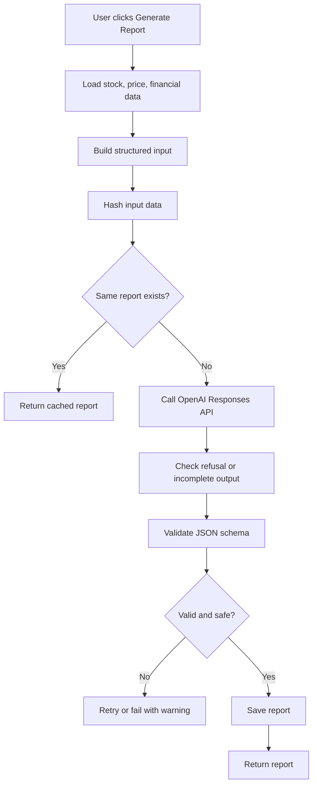

# AlphaLens JP AI設計書

## 目次
- [1. AI機能の目的](#purpose)
- [2. 利用API](#provider)
- [3. AIがやること/やらないこと](#scope)
- [4. 入力データ](#input-data)
- [5. 出力形式](#output-format)
- [6. プロンプト設計](#prompt)
- [7. ガードレール](#guardrails)
- [8. レポート生成フロー](#flow)
- [9. 評価方針](#evaluation)
- [10. 将来拡張](#future)

<a id="purpose"></a>
## 1. AI機能の目的

AI機能の目的は、日本株のファンダメンタルズ調査メモを短時間で作成することです。

AIは、銘柄の財務データ、株価サマリ、企業基本情報をもとに、成長性、収益性、安全性、リスク、追加確認ポイントを整理します。

<a id="provider"></a>
## 2. 利用API

MVPのAI機能はOpenAI APIで実装します。

利用方針:

- API: OpenAI Responses API
- 出力制御: Structured Outputs
- 出力形式: JSON Schema
- APIキー: `OPENAI_API_KEY`
- モデル: `OPENAI_MODEL` 環境変数で指定する

モデルIDはOpenAI側で更新される可能性があるため、実装時点の公式ドキュメントを確認して決めます。MVPでは、コストと品質のバランスがよい小型モデルを第一候補にします。より高品質な分析が必要な場合は、同じResponses APIのまま上位モデルへ差し替えます。

Responses APIでは、テキスト出力の `format` に `json_schema` を指定してStructured Outputsを有効にします。実装では、OpenAIから返る `response.id`、使用モデル、入力ハッシュ、スキーマ版をDBに保存します。

<a id="scope"></a>
## 3. AIがやること/やらないこと

### 3.1 AIがやること

- 財務データの要約
- 指標変化の説明
- 強み・懸念点の整理
- 追加で確認すべき論点の提示
- 調査メモの生成

### 3.2 AIがやらないこと

- 買い推奨
- 売り推奨
- 目標株価の提示
- 将来株価の予測
- 利益保証
- 投資助言

<a id="input-data"></a>
## 4. 入力データ

AIに渡す入力は、バックエンドで構造化します。

```json
{
  "stock": {
    "code": "7203",
    "name": "トヨタ自動車",
    "market": "Prime",
    "sector33": "輸送用機器"
  },
  "priceSummary": {
    "latestDate": "2026-06-05",
    "latestClose": 3021.5,
    "oneMonthChangePct": 0.034,
    "threeMonthChangePct": -0.012,
    "volumeTrend": "increasing"
  },
  "financials": [
    {
      "periodType": "FY",
      "periodEnd": "2026-03-31",
      "netSales": 45000000000000,
      "operatingProfit": 5000000000000,
      "profit": 3900000000000,
      "eps": 250.12,
      "bps": 2800.25,
      "equityRatio": 0.38
    }
  ],
  "missingData": [
    "cash_flow"
  ],
  "disclaimerPolicy": "Do not provide investment advice, target price, buy/sell recommendation, or guaranteed return."
}
```

<a id="output-format"></a>
## 5. 出力形式

OpenAI Responses APIのStructured Outputsを使い、JSON Schemaに沿ったJSON形式で出力させます。バックエンドでもJSON Schema検証を行い、失敗した場合は再生成またはエラーにします。

```json
{
  "summary": "string",
  "growth": "string",
  "profitability": "string",
  "stability": "string",
  "risks": ["string"],
  "checkpoints": ["string"],
  "evidence": [
    {
      "label": "string",
      "period": "string",
      "value": "string",
      "source": "string"
    }
  ],
  "dataLimitations": ["string"],
  "disclaimer": "このレポートは投資助言ではありません。"
}
```

`evidence` には、AIが本文で参照した主要指標を入れます。外部URLの引用ではなく、J-QuantsやMock Providerから取得した数値・期間・データソースを表示するためのフィールドです。

<a id="prompt"></a>
## 6. プロンプト設計

### 6.1 System Prompt

```text
あなたは日本株の企業調査を支援するリサーチアシスタントです。
与えられた構造化データだけを根拠に、企業のファンダメンタルズ調査メモを作成してください。

禁止事項:
- 買い推奨、売り推奨をしない
- 目標株価を出さない
- 将来株価を予測しない
- 利益を保証しない
- データにない事実を断定しない

出力は指定されたJSON形式に厳密に従ってください。
```

### 6.2 User Prompt Template

```text
以下の企業データをもとに、調査メモを作成してください。

観点:
1. 成長性
2. 収益性
3. 安全性
4. リスク
5. 追加で確認すべき点

注意:
- 投資助言ではなく調査メモとして出力する
- 欠損データがある場合は dataLimitations に書く
- 数値の根拠を本文内で簡潔に触れる
- 本文で触れた主要指標を evidence に含める

企業データ:
{{structured_input_json}}
```

<a id="guardrails"></a>
## 7. ガードレール

### 7.1 入力ガードレール

- ユーザー自由入力は銘柄検索と任意メモに限定する。
- AIにはユーザー入力を命令として直接渡さない。
- 入力データはバックエンドで整形し、許可されたフィールドのみ渡す。

### 7.2 出力ガードレール

出力に次の語句やパターンが含まれる場合は警告または再生成します。

- `買い`
- `売り`
- `絶対`
- `必ず上がる`
- `目標株価`
- `投資すべき`
- `保証`

ただし、企業資料の引用や一般文脈で誤検知する可能性があるため、MVPでは単純なブロックではなく、警告ログと再生成を優先します。

OpenAIの応答が安全上の拒否、スキーマ不一致、不完全出力になった場合は、レポートを保存せず `AI_PROVIDER_ERROR` として扱います。拒否理由やエラー詳細は `analysis_jobs.safety_flags` またはログに保存しますが、ユーザーに内部プロンプトやAPIキーを表示しません。

### 7.3 UI上の免責

AIレポート画面には次を表示します。

```text
このレポートは公開データに基づく調査支援メモであり、投資助言・売買推奨ではありません。最終的な投資判断はご自身で行ってください。
```

<a id="flow"></a>
## 8. レポート生成フロー



<a id="evaluation"></a>
## 9. 評価方針

AI機能は通常の単体テストだけでは品質を担保できないため、固定入力に対する評価を行います。

評価観点:

- JSON形式が守られているか
- 投資助言表現がないか
- 入力にない事実を断定していないか
- 欠損データに触れているか
- 成長性、収益性、安全性、リスク、確認点が出ているか

評価用データ:

- 大型株1件
- 成長株1件
- 赤字企業1件
- 財務データ欠損ケース1件
- 株価データ欠損ケース1件

<a id="future"></a>
## 10. 将来拡張

- EDINET有価証券報告書のPDF/XBRLを取り込み、RAGで根拠引用する。
- 決算短信や説明資料をS3に保存し、ベクトル検索する。
- ニュースAPIを追加し、定性情報も要約する。
- 米国株や暗号資産オンチェーン分析に拡張する。
- レポート生成を非同期ジョブ化し、進捗をWebSocketで表示する。
