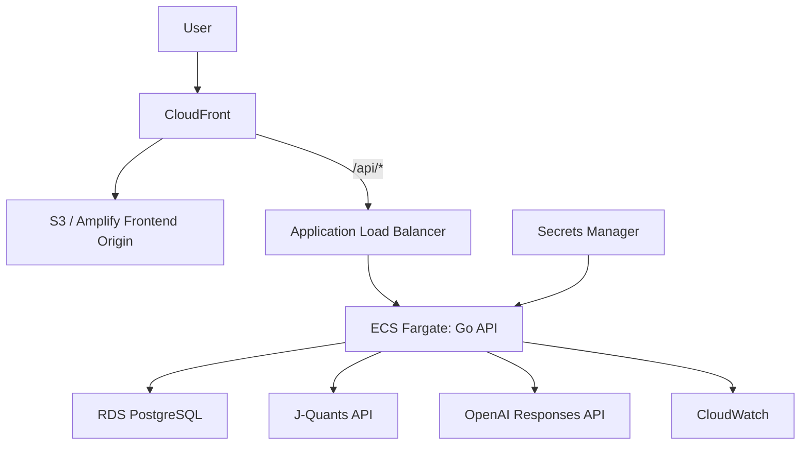
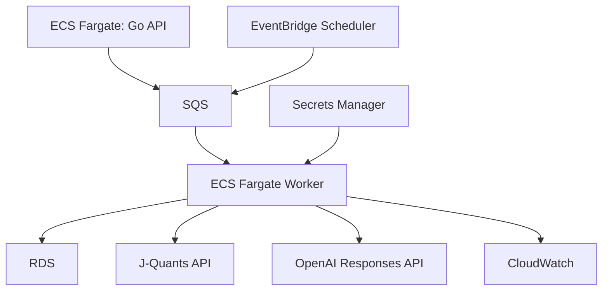

# AlphaLens JP インフラ設計書

## 目次
- [1. インフラ方針](#policy)
- [2. AWS構成](#aws-architecture)
- [3. 環境構成](#environments)
- [4. ネットワーク](#network)
- [5. デプロイ方式](#deploy)
- [6. Secrets管理](#secrets)
- [7. 監視・ログ](#monitoring)
- [8. コスト管理](#cost)
- [9. IaC方針](#iac)

## 1. インフラ方針

MVPでは、実装速度とAWSアピールのバランスを取ります。ローカルではDocker Compose、本番ではAWSにデプロイします。

優先順位:

1. 公開URLでデモできる
2. API、DB、外部API連携、AI生成が動く
3. ログとエラーを確認できる
4. AWS SAAの知識を構成図で説明できる
5. コストを抑える

## 2. AWS構成

将来拡張:

MVPではWorker、SQS、EventBridgeを省略し、Go API内で同期的にAIレポート生成してもよいです。ただし、コード上は後からWorkerに切り出せるようにサービス層を分離します。

## 3. 環境構成

| 環境 | 用途 | 構成 |
| --- | --- | --- |
| local | 開発 | Docker Compose、PostgreSQL、Mock Provider |
| staging | 動作確認 | AWS最小構成、本番相当の環境変数 |
| production | 公開デモ | AWS公開URL、監視あり |

ポートフォリオではstagingとproductionを分けなくてもよいですが、READMEには本来の分離方針を書きます。

## 4. ネットワーク

推奨構成:

- VPCを作成する。
- Public SubnetにALBを配置する。
- Private SubnetにECS TaskとRDSを配置する。
- ECSから外部APIへ出るためにNAT GatewayまたはNAT相当を用意する。

コスト削減案:

- MVPデモではNAT Gatewayを避け、外部通信が必要なECS TaskをPublic Subnetに置き、Security GroupでALBからの受信だけ許可する選択もあり。
- ただしREADMEでは、商用運用ではPrivate Subnet + NAT Gatewayにする理由を説明する。

## 5. デプロイ方式

### 5.1 Frontend

候補:

- AWS Amplify Hosting
- Vercel
- S3 + CloudFront

推奨:

- AWSアピール重視ならS3 + CloudFrontまたはAmplify Hosting
- Next.jsを静的exportできる構成ならS3 + CloudFront
- SSRやサーバーアクションを使う場合はAmplify HostingなどNext.js対応ホスティングを選ぶ

### 5.2 Backend

候補:

- ECS Fargate
- Lambda + API Gateway

推奨:

- Go APIはECS Fargateでコンテナ化する。
- Docker、ALB、RDS、CloudWatchを説明できるため、フルスタック/AWSポートフォリオとして見栄えがよい。

### 5.3 Database

- RDS PostgreSQLを使用する。
- 個人開発MVPでは小さいインスタンスを使う。
- 開発環境はDocker ComposeのPostgreSQLでよい。

## 6. Secrets管理

管理対象:

- DB接続情報
- J-Quants APIキー
- OpenAI APIキー
- Cookie署名キー

管理方針:

- ローカルは `.env.local` を使用し、Git管理しない。
- AWSはSecrets ManagerまたはSSM Parameter Storeを使用する。
- フロントエンドに外部APIキーを渡さない。

## 7. 監視・ログ

CloudWatch Logsに出力するログ:

- APIリクエスト
- 外部API呼び出し
- AI生成ジョブ
- エラー
- 処理時間

アラーム候補:

- 5xxエラー率
- AI生成失敗率
- 外部API 429回数
- RDS CPU使用率
- ECS Task停止

## 8. コスト管理

コストを抑える方針:

- まずは小さいRDSインスタンスを使う。
- 開発中は不要な環境を停止する。
- AIレポート生成はキャッシュする。
- J-QuantsやOpenAI APIのレート制限と利用量をログで確認する。
- S3保存は必要最小限にする。

MVPの目標コスト:

- 月額数千円から1万円台を目安にする。ALB、RDS、NAT Gatewayは固定費が出やすいため、デプロイ前に見積もる。
- NAT Gatewayはコストが上がりやすいため、MVP段階では採用可否を慎重に判断する。

## 9. IaC方針

IaCはTerraformまたはAWS CDKを使います。

推奨:

- AWS SAAの知識を見せたいならTerraform。
- TypeScript中心で速度重視ならAWS CDK。

MVPでは次をIaC化します。

- VPC
- ECS Cluster
- ECS Service
- ALB
- RDS
- Secrets
- CloudWatch Logs
- Frontend hosting

将来拡張では次を追加します。

- S3 artifact bucket
- SQS
- EventBridge
- Worker service
